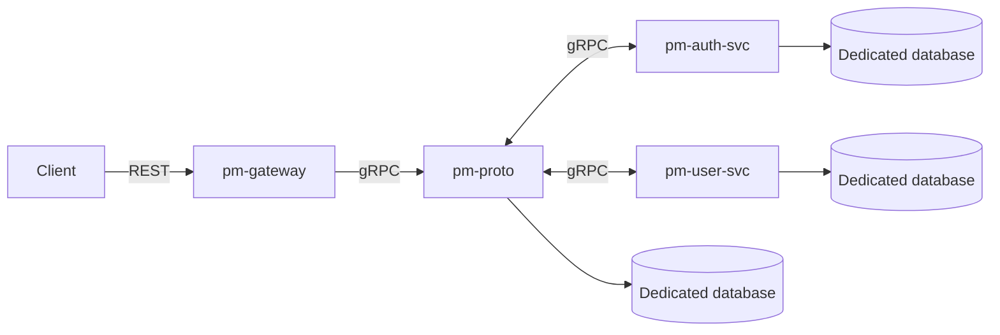

# Pure Minerals · Microservices

> Coordination and documentation repository for the **Pure Minerals** microservices platform.

[](#architecture)
[](#architecture)
[](#architecture)

## Overview

This repository centralizes documentation and local setup for the services that make up Pure Minerals. Each service maintains its own lifecycle and database; external access is handled through the gateway.

## Services

| Service | Responsibility | Technology / access | Repository |
| --- | --- | --- | --- |
| `pm-gateway` | Single entry point for platform consumers. | REST API | [View repository](https://github.com/pav-dev98/pm-gateway) |
| `pm-proto` | Unified interface for the microservices. | gRPC API | [View repository](https://github.com/pav-dev98/pm-proto) |
| `pm-auth-svc` | Platform authentication. | Authentication service | [View repository](https://github.com/pav-dev98/pm-auth-svc) |
| `pm-user-svc` | User management. | User service | Repository to be defined |

## Architecture



- Clients access the platform through `pm-gateway`.
- Service-to-service communication uses **gRPC**.
- Each service owns its data and uses an independent database.
- Services are deployed on **Kubernetes**.

## Quick start

### Prerequisites

- [Git](https://git-scm.com/) installed and access to the listed repositories.
- Each service documents its own dependencies and environment requirements in its repository.

### Clone the services

From the root of this repository, run:

```bash
./init.sh
```

The script currently clones `pm-gateway`, `pm-proto`, and `pm-auth-svc` as sibling directories. Then follow each service's README to configure and run it.

## Repository structure

```text
.
├── init.sh       # Clones the available service repositories
└── README.md     # Platform documentation and map
```

## Contributing

Implementation changes should be made in the corresponding service repository. When changing the platform composition, update this README and `init.sh` as well to keep the coordination documentation current.

---

Built for the **Pure Minerals** platform.
